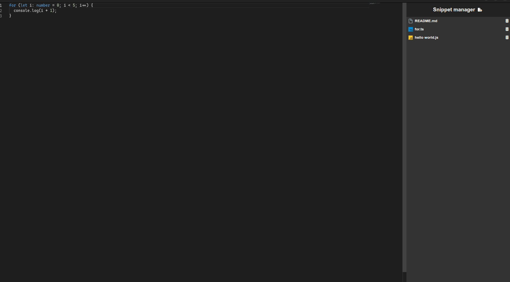

# Snippet Manager

## Install:

You can install the snppet manager by going to the release part in the github repo
Or
Clone this repo, do npm i and build the app

## Usage:

After installing the app you will find a readme.md in your desktop that explains how to use it

